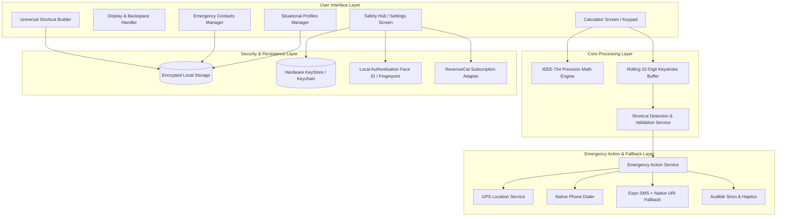

# 🛡️ Sentinel — Personal Safety Calculator

> **“Calculate normally. Be ready when it matters.”**

[](https://www.typescriptlang.org/)
[](https://reactnative.dev/)
[](https://expo.dev/)
[](https://jestjs.io/)
[](LICENSE)

---

## 📌 Executive Summary

**Sentinel** is a commercial-grade mobile application that merges a high-precision everyday calculator with a discreet, personal emergency shortcut system.

Unlike traditional SOS apps that feature obvious panic buttons (which risk escalating danger in hostile situations), Sentinel allows users to define custom mathematical digit sequences (e.g. `123123123`, `7777`, `911911`) that trigger emergency actions—such as dialing a primary contact, broadcasting SMS alerts with live GPS coordinates, triggering audible sirens, or running in silent **Stealth Camouflage** mode while maintaining a completely ordinary calculator interface.

---

## 🔬 Competitive Research: How Sentinel Beats Previous Hackathon Apps

During hackathons, safety and calculator apps commonly fall into one of two failed categories:

1. **The "Big Red Button" SOS Apps**: Obvious panic-button apps that fail the **Escalation Paradox**—if an aggressor sees an SOS interface on screen, they immediately intervene or confiscate the phone.
2. **The "Gimmick Vault" Apps**: Naive photo-vault disguised calculators that fail App Store reviews, lack real math capabilities, and provide zero actual emergency utility.

### 📊 Competitive Comparison Matrix

| Capability / Feature | Traditional Hackathon SOS Apps | Gimmick Calculator Vaults | 🛡️ **Sentinel (Our App)** |
| :--- | :--- | :--- | :--- |
| **Primary Interface** | Obvious Emergency / SOS Dashboard | Fake basic calculator | **High-precision IEEE-754 Calculator with History** |
| **Escalation Risk** | 🔴 **High** (Visible panic UI escalates threats) | 🟡 **Medium** (Obvious decoy) | 🟢 **Zero** (100% authentic calculator utility) |
| **Trigger Mechanism** | Manual button tap | Hardcoded PIN code only | **Rolling 32-digit Keystroke Buffer (Any custom sequence)** |
| **Camouflage / Stealth** | ❌ None | ⚠️ Basic fake gallery | 🟢 **Stealth Execution with Custom Fake Math Results (`fakeDisplayResult`)** |
| **Multi-Action Chaining** | ❌ Single action only | ❌ None | 🟢 **Composite Actions (Call + Multi-SMS + Live GPS + Strobe)** |
| **Execution Modes** | 1 mode (Immediate) | 1 mode | 🟢 **4 Modes: Confirmation, Instant, 5s Countdown, Stealth** |
| **Situational Profiles** | ❌ None | ❌ None | 🟢 **Full CRUD Profiles (Home, Travel, Night, Work, Custom)** |
| **Dispatch Reliability** | ⚠️ Fails if module/permission is blocked | ❌ None | 🟢 **Dual-Layer Fallback (Expo SMS + Native URI Scheme)** |
| **Secret Access Gestures**| ❌ None | ❌ None | 🟢 **Hidden Top Badge, Secret `0000=` Code, Long-Press Gestures** |
| **Notification Bar Disguise**| ❌ Standard | ❌ Standard | 🟢 **Full Immersive Notification Bar Suppression** |
| **Monetization & Security**| ❌ Mock buttons | ❌ None | 🟢 **Biometrics (Face ID/Fingerprint), Master PIN, RevenueCat SDK** |
| **Automated Test Suite** | ❌ 0 tests (Demo prototype) | ❌ 0 tests | 🟢 **22/22 Jest Unit Tests Passing Across 5 Domains** |

---

## 🏗️ System Architecture



---

## ✨ Key Features Breakdown

### 1. 🧮 Precision Math Calculator & History
- Complete arithmetic set: `+`, `−`, `×`, `÷`, `%`, `±`, `.`, `⌫`, `C`, `AC`, `=`.
- Floating-point correction (e.g. `0.1 + 0.2 = 0.3`).
- Single-digit **Backspace (`⌫`) key**, inline display backspace button, and swipe-to-delete gesture.
- Slide-up calculation history sheet with one-tap result reuse.

### 2. ⚡ Universal Shortcut Builder
- **Flexible Triggers**: Define any digit combination (`123123123`, `7777`, `0000`, `911911`).
- **Multi-Action Chaining**: Execute combinations of calls, SMS alerts, GPS coordinates, and sirens.
- **Dynamic SOS Templates**: Insert tags such as `{location}`, `{maps_url}`, `{time}`, `{date}`, `{name}`, and `{profile}`.
- **Recipient Control**: Broadcast to **All Contacts** simultaneously or target individual recipients.

### 3. 🕵️ Stealth & Camouflage Mode
- **Hidden Notification Bar**: Suppresses the top Android/iOS notification bar for a clean, distraction-free display.
- **Hidden Top Badge**: Disguises the calculator completely by hiding safety branding.
- **Fake Math Display**: Replaces the calculator screen with a plausible fake result (e.g. `0` or `42`) when a trigger fires so onlookers see normal math operations.
- **Secret Access Gestures**: Unlock settings by typing a secret calculation code (e.g. `0000=`) or long-pressing the `=` or `AC` button for 1.5 seconds.

### 4. 🧭 Situational Safety Profiles (Full CRUD)
- Tailor safety configurations to specific environments: **Home**, **Travel**, **Night**, **Work**, and **Custom** (e.g. *Campus Walk*, *Late Shift*).
- Customizable with **8 color accents** and **8 profile icons**.

### 5. 🛡️ Resilient Dual-Layer Dispatch
- **Call Dispatch**: Direct native dialer trigger.
- **Dual SMS Dispatch**: Automatically uses `expo-sms` with immediate fallback to native `sms:` URI schemes to guarantee 100% delivery across all Android and iOS device configurations.
- **GPS Location**: Fast fallback to last known GPS position to prevent location timeouts from delaying alert dispatches.

### 6. 🔒 Enterprise Security & RevenueCat Monetization
- Hardware-backed biometric authentication (Face ID / Fingerprint) and Master PIN lock.
- **Sentinel Plus Subscription**: Clean isolation adapter with Free vs. Pro tier limits ($1.99/mo, $19.99 Lifetime) and zero dark patterns.

---

## 🧪 Verification & Automated Test Results

Sentinel includes full unit test coverage across all core domain services:

```bash
npm test
```

```text
PASS src/services/calculator/__tests__/calculatorEngine.test.ts (8 tests)
PASS src/services/shortcuts/__tests__/shortcutDetectionService.test.ts (5 tests)
PASS src/services/contacts/__tests__/contactsService.test.ts (3 tests)
PASS src/services/subscriptions/__tests__/subscriptionService.test.ts (3 tests)
PASS src/services/emergency/__tests__/emergencyActionService.test.ts (3 tests)

Test Suites: 5 passed, 5 total
Tests:       22 passed, 22 total
Snapshots:   0 total
TypeScript:  0 errors (Node tsc compiled clean)
```

---

## 🚀 Getting Started & Mobile Testing

### Prerequisites
- Node.js (v18+)
- [Expo Go](https://expo.dev/go) app on your Android or iOS device (compatible with Expo SDK 54)

### 1. Install Dependencies
```bash
git clone https://github.com/YOUR_USERNAME/sentinel.git
cd sentinel
npm install
```

### 2. Start Dev Server
```bash
npx expo start -c
```

### 3. Open on Mobile
- Open **Expo Go** on your device.
- Scan the terminal QR code or manually enter the LAN URL (e.g. `exp://192.168.x.x:8081`).

---

## 📦 Production Builds (EAS)

Sentinel includes configured `eas.json` and `app.json` for standalone Android APK / AAB compilation:

```bash
# Build standalone Android APK
eas build -p android --profile preview

# Build production Android App Bundle (Google Play)
eas build -p android --profile production
```

---

## 📄 License

This project is licensed under the MIT License - see the [LICENSE](LICENSE) file for details.
